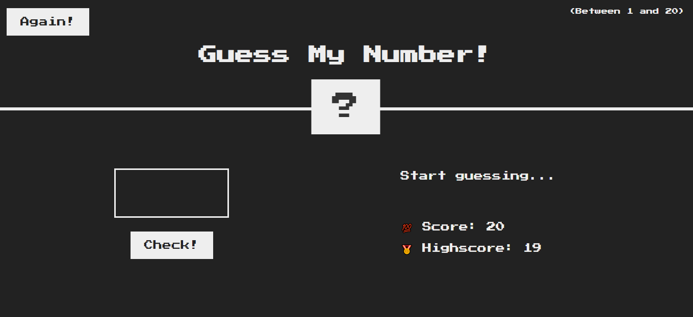

# guess my number
## Mini game developed to practice javascript.

- In this game, you have to guess which number is hide behind the interrogation element
- Your initial score is 20 and as long as you get the wrong answer, your score decrease
- If you get the right answer before your score = 0, you win

